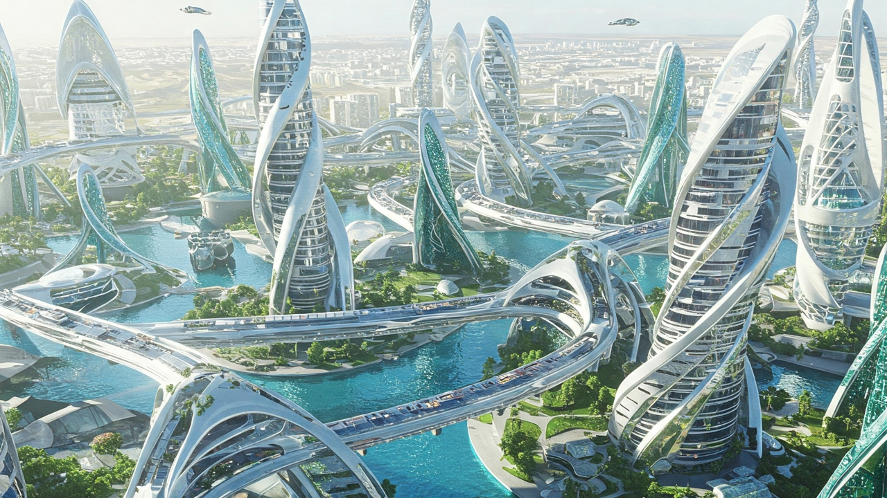

# Silver Robot

## Game Design Document

**DOWNLOAD: [GameDesignDocument.pdf](./GameDesignDocument.pdf)**

**YouTube Video (1-minute version): [https://youtu.be/_-MGMgaxizU](https://youtu.be/_-MGMgaxizU)**

**GitHub Repository: [https://github.com/jckuri/silver_robot_v2](https://github.com/jckuri/silver_robot_v2)**

**Builts for Linux, Windows, and Mac: [https://github.com/jckuri/silver_robot/tree/main/BUILD](./BUILD/)**

A GDD (game design document) is a highly descriptive, living document of the design of a video game. It helps to define the game details and features you intend for your game.

Completing a draft of this document upfront and then revisiting it to add and update it during your game development process is recommended. The final version of this document does not necessarily need to represent the final version of your game.

While not all of this information will directly impact your finished 2D Platformer Game build, it will help you plan the project, source the assets, and develop the game.

Please complete all of the numbered bullet points below. 

Table Of Contents

[Game Design Sketch](#game-design-sketch) 
[Game Concept](#game-concept) 
[Game Mechanics](#game-mechanics) 
[Optional: Standout Suggestions](#optional-standout-suggestions) 

### Game Design Sketch

This section includes at least one game design sketch that you create. It communicates your ideas for the game, such as its appearance, structure, and behavior. The sketch(es) need to show 3 tile map layers and 2 or more user interface elements. Optionally, the sketch(es) may include additional elements as you like. 

**1. Add your sketch(es) here**

Motion parallax has 3 layers:

**Midground layer**

**Cloud layer**

The cloud layer has fully transparent pixels, partially transparent pixels, and fully opaque pixels representing the clouds, which are in the middle of the midground layer and the background layer.

**Background layer**

The game has blocks, fires, coins, crates, and the player Silver Robot. The UI has 2 elements: The Restart button and a text with information about the coins collected and the total amount of coins to be collected.

**UnityProjectWindow.png**

### Game Concept

This section describes the game’s story, environment, characters, etc.

**2. What is the storyline or narrative of your game?**

Silver Robot is a 2D Platformer Game whose objective is to collect 50 coins while avoiding the fires. This video game is tricky and not so easy to win because you need to think about how to solve many problems. But it is very entertaining.

**3. What are the main characters and objects in your game, and what roles do they play in the story and gameplay?**

The main character is Silver Robot who has to avoid the fires and collect all the 50 coins in order to win the videogame. Correctly using the 3 crates in the game is mandatory. Otherwise you won’t be able to solve the puzzle of collecting all the 50 coins.

### Game Mechanics

This section includes the core gameplay mechanics, input controls, and how the player interacts with the game.

**4. What is the complete list of input actions that the player can perform, and how do these actions impact the game world?**

Silver Robot can move with the left arrow and the right arrow. Silver Robot can jump with the up arrow. Silver Robot can push the crates by walking toward them.

**5. What is the typical gameplay loop (repeated actions) for the player?**

Silver Robot has to avoid the fires and collect all the 50 coins in order to win the videogame. Correctly using the 3 crates in the game is mandatory. Otherwise you won’t be able to solve the puzzle of collecting all the 50 coins.

### Optional: Standout Suggestions

This section contains "Standout Suggestions" for your game. These are game mechanics or other game features that aren't necessary for your game, but that would be great additions if you have the spare time. Adding such extras can really make your game shine. So, if you complete your game ahead of schedule, you might think about adding one or more of these ideas. For example, the following are standout suggestions that are relevant for a 2D Platformer type of game. 

**6. Playable Character Double Jump**

Not implemented.

**7. Breakable Crate Object**

Not implemented.

**8. Enemy Character AI**

Fires can patrol. They walk side to side over and over again. This is a very basic behavior.

---------------------------

<table border="1">

<tr><td>
In order to switch between the 1-minute version and the full version, you just need to change the number of `Total Coins` from 14 to 50. Or vice versa, from 50 to 14. In order access the field `Total Coins`, you need to go to the `Canvas`, then click on `CoinsText`, and then scroll down to the section `CoinManager (Script)`.
</td></tr>

<tr><td align="center">

</td></tr>

<tr><td align="center">

</td></tr>

<tr><td>
By default in this GitHub repository, the number of `Total Coins` is 14. So, collecting all the 14 coins will take less than 1 minute.
But if you want to experience the full video game, try changing the number of `Total Coins` to 50. 
</td></tr>

<tr><td>
<b>YouTube Video (full version): <a href="https://youtu.be/BhYPSAWtp38">https://youtu.be/BhYPSAWtp38</a> </b>
</td></tr>

</table>
